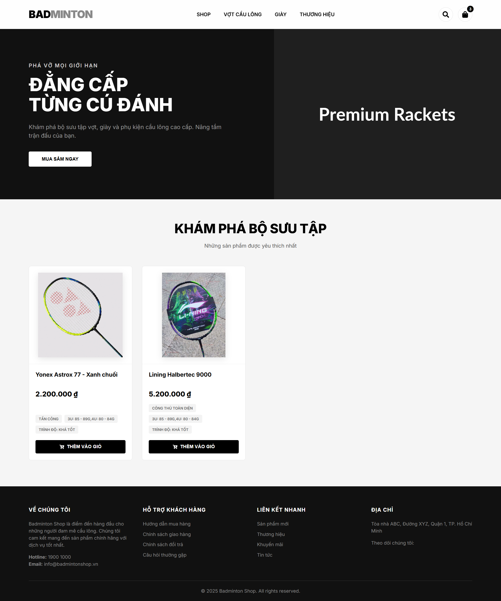

<div align="center">

# 🏸 VNB SPORTS - ECOMMERCE

### Cửa hàng dụng cụ cầu lông chuyên nghiệp | Minimalist & Modern Design




<br />

<p align="center">
  <a href="#-tính-năng">Tính Năng</a> •
  <a href="#-công-nghệ">Công Nghệ</a> •
  <a href="#-cài-đặt">Cài Đặt</a> •
  <a href="#-liên-hệ">Liên Hệ</a>
</p>

</div>

---

## 🌟 Giới Thiệu

**VNB Sports** là một ứng dụng web Full-stack được thiết kế riêng cho việc kinh doanh dụng cụ cầu lông. Dự án tập trung vào trải nghiệm người dùng với phong cách thiết kế **Monochrome (Đen/Trắng)**, tối giản nhưng sang trọng, làm nổi bật vẻ đẹp của sản phẩm.

### ✨ Điểm Nhấn
* 🎨 **Giao diện Premium:** Thiết kế hiện đại, bo góc tinh tế, hiệu ứng hover mượt mà.
* 📱 **Responsive:** Hiển thị hoàn hảo trên mọi thiết bị (PC, Tablet, Mobile).
* ⚡ **Hiệu năng cao:** Sử dụng Vite và React cho tốc độ tải trang cực nhanh.
* 🔍 **Trải nghiệm sản phẩm:** Hiển thị thông số kỹ thuật (Trọng lượng, điểm cân bằng) trực quan.

---

## 🛠 Tech Stack (Công Nghệ)

| Hạng mục | Công nghệ sử dụng | Mô tả |
| :--- | :--- | :--- |
| **Frontend** |   | Xây dựng giao diện người dùng. |
| **Styling** |  | Custom Properties, Flexbox, Grid Layout. |
| **Backend** |   | API Server xử lý logic. |
| **Database** |  | Lưu trữ dữ liệu sản phẩm. |
| **Language** |  | Đảm bảo code chặt chẽ, ít lỗi. |

---

## 🚀 Hướng Dẫn Cài Đặt (Local)

Làm theo các bước sau để chạy dự án trên máy tính của bạn:

### 1️⃣ Thiết lập Database
Khởi động **XAMPP (Apache & MySQL)**, truy cập `phpMyAdmin` và chạy lệnh SQL sau:


```sql
CREATE DATABASE IF NOT EXISTS `badminton-shop`;
USE `badminton-shop`;

CREATE TABLE IF NOT EXISTS `products` (
    `id` INT AUTO_INCREMENT PRIMARY KEY,
    `name` VARCHAR(255) NOT NULL,
    `price` DECIMAL(10, 0) NOT NULL,
    `image` VARCHAR(255),
    `description` TEXT,
    `player_level` VARCHAR(100),
    `play_style` VARCHAR(100),
    `shaft_stiffness` VARCHAR(50),
    `weight` VARCHAR(50)
);

INSERT INTO `products` (`name`, `price`, `image`, `description`, `player_level`, `play_style`, `weight`) VALUES
('Vợt Yonex Astrox 100ZZ', 3800000, '[https://i.imgur.com/Example1.png](https://i.imgur.com/Example1.png)', 'Siêu phẩm tấn công', 'Chuyên nghiệp', 'Tấn công', '3U/4U'),
('Vợt Lining Axforce 80', 3200000, '[https://i.imgur.com/Example2.png](https://i.imgur.com/Example2.png)', 'Công thủ toàn diện', 'Khá - Tốt', 'Toàn diện', '4U'),
('Vợt Victor Ryuga II', 2900000, '[https://i.imgur.com/Example3.png](https://i.imgur.com/Example3.png)', 'Vợt rồng đen quyền lực', 'Khá', 'Tấn công', '3U/4U');
```

### 2️⃣ Khởi chạy Backend (Server)

```bash
cd badminton-be
npm install     # Cài đặt dependencies
node server.js  # Server chạy tại port 3000
```

### 3️⃣ Khởi chạy Frontend (Client)

```bash
cd badminton-fe
npm install     # Cài đặt dependencies
npm run dev     # Client chạy tại port 5173
```

🔥 **Truy cập ngay:** `http://localhost:5173`

-----

## 📂 Cấu Trúc Dự Án

```text
BADMINTON-SHOP/
├── 📂 badminton-be/         # Xử lý Logic & API
│   ├── server.js           # Entry point
│   └── package.json
│
└── 📂 badminton-fe/         # Giao diện người dùng
    ├── 📂 src/
    │   ├── 📂 components/  # Header, Footer, Card...
    │   ├── App.css         # Global Styles (Minimalist)
    │   └── App.tsx
    ├── index.html          # SEO Optimized
    └── vite.config.ts
```

-----

## 🔮 Roadmap (Dự Định)

  - [x] Khởi tạo dự án & Kết nối Database.
  - [x] Giao diện danh sách sản phẩm (Grid View).
  - [ ] **Trang chi tiết sản phẩm** (Product Detail).
  - [ ] **Giỏ hàng & Thanh toán** (Cart & Checkout).
  - [ ] **CMS Admin** (Quản lý thêm/sửa/xóa).
  - [ ] **Dark Mode** (Chế độ ban đêm).

-----

## 🤝 Kết Nối & Đóng Góp

Dự án được thực hiện bởi **[Cao Đăng Khoa]**. Mọi ý kiến đóng góp, báo lỗi hay yêu cầu tính năng mới đều được hoan nghênh!

<div align="center">

<a href="https://github.com/username-cua-ban">
  
</a>
&nbsp;
<a href="https://facebook.com/link-cua-ban">
  
</a>
&nbsp;
<a href="mailto:email-cua-ban@gmail.com">
  
</a>

<br />
<br />

*Nếu bạn thấy dự án hữu ích, hãy ủng hộ tác giả bằng cách:*
<br />
⭐ **Star dự án này** • 🍴 **Fork dự án** • 🐛 **Report Bug**

</div>

---

<p align="center">
  <b>© 2025 Badminton Shop Project.</b><br />
  <i>Designed with ❤️ and 🏸 by <a href="https://github.com/username-cua-ban">Cao Đăng Khoa</a></i>
</p>